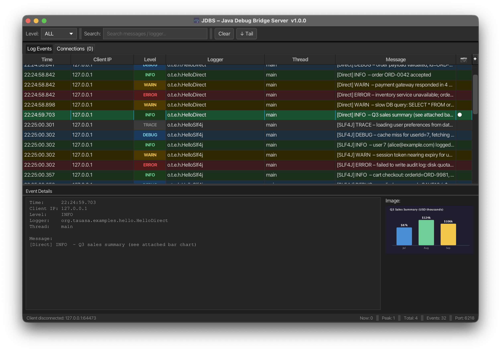
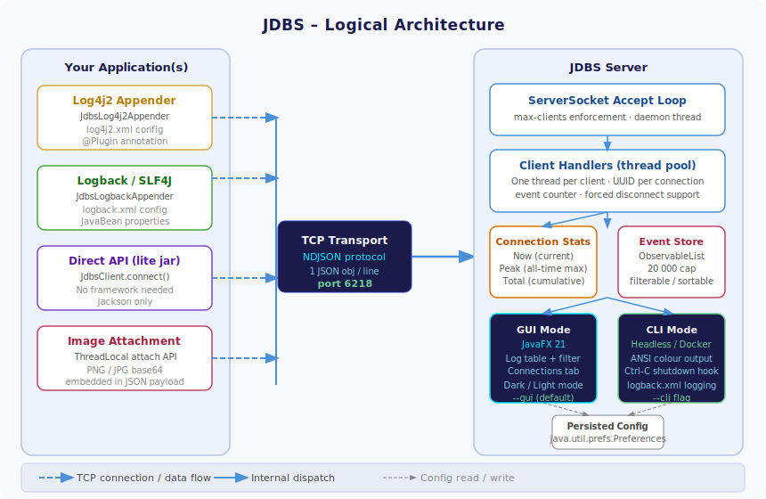

# JDBS – Java Debug Bridge Server

A lightweight TCP debug-logging server for Java applications. Clients connect over a plain TCP socket and stream structured JSON log events — including **optional PNG/JPG image attachments** — to the server in real time.

The server runs either as a **JavaFX GUI** or a **headless CLI** process, and integrates with **Log4j2**, **SLF4J/Logback**, or directly via a **lite API jar**.



---

## Table of Contents

1. [Architecture](#architecture)  
2. [Requirements](#requirements)  
3. [Building](#building)  
4. [Starting the Server](#starting-the-server)  
5. [Stopping the Server](#stopping-the-server)  
6. [Configuration & Settings](#configuration--settings)  
7. [Client Integration](#client-integration)  
   - [Logback / SLF4J](#logback--slf4j)  
   - [Log4j2](#log4j2)  
   - [Direct API (lite jar)](#direct-api-lite-jar)  
8. [Sending Images](#sending-images)  
9. [GUI Reference](#gui-reference)  
10. [Protocol Reference](#protocol-reference)  
11. [Project Structure](#project-structure)  

---

## Architecture


**Flow:**

```
Your App  →  Appender / JdbsClient  →  TCP :6218  →  JDBS Server
                                       (NDJSON)        └─ GUI  (JavaFX)
                                                        └─ CLI  (headless)
```

Each log event is a single-line JSON object (**NDJSON**) written to the TCP socket.  The server's `ClientHandler` splits on newlines and deserializes into `LogEvent` objects, which are dispatched to the UI.

---

## Requirements

| Component | Minimum version |
|-----------|----------------|
| Java (server + GUI) | **17** |
| Java (lite client jar) | **11** |
| Maven (build) | **3.8** |
| JavaFX | bundled in fat jar |

> **Apple Silicon (M-series):** pass `-Djavafx.platform=mac-aarch64` to Maven to pull the native ARM JavaFX jars.

---

## Building

```bash
# Clone the repo
git clone https://github.com/tauasa/jdbs.git
cd jdbs

# Build everything (server fat jar + client fat jar + client lite jar)
mvn clean package

# Output artifacts:
#   jdbs-server/target/jdbs-server-1.0.0-fat.jar   ← server (GUI + CLI)
#   jdbs-client/target/jdbs-client-1.0.0-fat.jar   ← full client (Log4j2 + Logback)
#   jdbs-client/target/jdbs-client-1.0.0-lite.jar  ← lightweight client (Jackson only)
```

---

## Starting the Server

### Option A — Shell/Batch scripts (recommended)

The convenience scripts auto-detect the fat jar and perform a Java version check.

**Linux / macOS:**
```bash
# Make executable (first time only)
chmod +x start-jdbs.sh

# GUI mode (default)
./start-jdbs.sh

# CLI / headless mode
./start-jdbs.sh --cli

# Custom port and client limit
./start-jdbs.sh --port=7000 --max-clients=20

# CLI + custom settings
./start-jdbs.sh --cli --port=7000 --max-clients=5
```

**Windows:**
```bat
REM GUI mode
start-jdbs.bat

REM CLI mode
start-jdbs.bat --cli

REM Custom settings
start-jdbs.bat --port=7000 --max-clients=20
```

---

### Option B — `java -jar` directly

```bash
java -jar jdbs-server/target/jdbs-server-1.0.0-fat.jar
java -jar jdbs-server/target/jdbs-server-1.0.0-fat.jar --cli
java -jar jdbs-server/target/jdbs-server-1.0.0-fat.jar --port=9000
java -jar jdbs-server/target/jdbs-server-1.0.0-fat.jar --cli --port=9000 --max-clients=50
```

### Option C — Maven (dev mode, GUI only)

```bash
cd jdbs-server
mvn javafx:run
```

---

### Command-line flags

| Flag | Description | Default |
|------|-------------|---------|
| `--cli` | Run in headless CLI mode (no JavaFX) | GUI mode |
| `--port=N` | Listening port | `6218` |
| `--max-clients=N` | Maximum concurrent client connections | `10` |

> Settings passed on the command line **override** persisted preferences  
> but are not written back to the preference store.

---

### JVM tuning

```bash
# Increase max heap for high-volume logging
java -Xmx1g -jar jdbs-server-1.0.0-fat.jar

# Override root log level (server's own internal logs)
java -Dlogging.level.root=DEBUG -jar jdbs-server-1.0.0-fat.jar

# Use a custom Logback config for the server
java -Dlogback.configurationFile=/etc/jdbs/logback.xml -jar jdbs-server-1.0.0-fat.jar

# Headless / Docker (no display)
java -Djava.awt.headless=true -jar jdbs-server-1.0.0-fat.jar --cli
```

---

### Running as a systemd service (Linux)

```ini
# /etc/systemd/system/jdbs.service
[Unit]
Description=JDBS Debug Server
After=network.target

[Service]
Type=simple
User=jdbs
ExecStart=/usr/bin/java -Xmx512m -jar /opt/jdbs/jdbs-server-1.0.0-fat.jar --cli --port=6218
Restart=on-failure
RestartSec=10

[Install]
WantedBy=multi-user.target
```

```bash
sudo systemctl daemon-reload
sudo systemctl enable --now jdbs
sudo journalctl -u jdbs -f      # tail logs
```

---

### Running in Docker

```dockerfile
FROM eclipse-temurin:21-jre
COPY jdbs-server/target/jdbs-server-1.0.0-fat.jar /app/jdbs-server.jar
EXPOSE 6218
ENTRYPOINT ["java", "-Djava.awt.headless=true", "-jar", "/app/jdbs-server.jar", "--cli"]
```

```bash
docker build -t jdbs .
docker run -p 6218:6218 jdbs
```

---

## Stopping the Server

| Mode | How to stop |
|------|-------------|
| **GUI** | `File → Exit`, or close the window, or `⌘Q` / `Ctrl+Q` |
| **CLI** | `Ctrl-C` — triggers the registered shutdown hook, which closes all client connections cleanly before exiting |
| **systemd** | `sudo systemctl stop jdbs` |
| **Docker** | `docker stop <container-id>` (sends SIGTERM → shutdown hook runs) |

The server performs a **graceful shutdown**:

1. Stops accepting new connections.  
2. Closes all active `ClientHandler` sockets.  
3. Waits up to 3 seconds for the thread pool to drain.  
4. Saves configuration to the OS preference store (GUI mode).

---

## Configuration & Settings

### GUI Settings dialog (`Edit → Settings` / `⌘,`)

| Setting | Description |
|---------|-------------|
| **Port** | TCP listening port (restart required to apply) |
| **Max Clients** | Maximum concurrent connections (enforced at accept-time) |
| **Beep on connect** | Play a system beep (`java.awt.Toolkit.beep()`) when a new client connects |

Settings are persisted via `java.util.prefs.Preferences` under the user's OS  
preference store (Registry on Windows, `~/.java/.userPrefs` on Linux/macOS).

### View menu

| Item | Description |
|------|-------------|
| **Dark Mode / Light Mode** | Toggle theme (persisted) |
| **Clear Log** | Remove all in-memory events |
| **Auto-Scroll** | Keep the log table scrolled to the newest event |

---

## Client Integration

Add the JDBS client jar to your application's classpath.  
Choose the jar that matches your setup:

| Jar | Contents | When to use |
|-----|----------|-------------|
| `jdbs-client-1.0.0-fat.jar` | Transport + Log4j2 + Logback | Drop-in; zero other deps needed |
| `jdbs-client-1.0.0-lite.jar` | Transport + Jackson only | Already have a logging framework; or using `JdbsClient` API directly |
| Maven dependency (thin) | Just JDBS classes | Manage deps via Maven yourself |

---

### Logback / SLF4J

**Maven dependency:**
```xml
<dependency>
    <groupId>org.tauasa.apps</groupId>
    <artifactId>jdbs-client</artifactId>
    <version>1.0.0</version>
</dependency>
```

**`logback.xml`:**
```xml
<configuration>

  <appender name="JDBS"
            class="org.tauasa.apps.jdbs.client.logback.JdbsLogbackAppender">
    <host>localhost</host>
    <port>6218</port>
    <level>DEBUG</level>          <!-- minimum level to forward -->
    <reconnectDelayMs>5000</reconnectDelayMs>
  </appender>

  <!-- Wrap in AsyncAppender – strongly recommended in production -->
  <appender name="ASYNC_JDBS" class="ch.qos.logback.classic.AsyncAppender">
    <queueSize>512</queueSize>
    <discardingThreshold>0</discardingThreshold>
    <appender-ref ref="JDBS"/>
  </appender>

  <root level="DEBUG">
    <appender-ref ref="ASYNC_JDBS"/>
  </root>

</configuration>
```

**Java code (SLF4J API):**
```java
import org.slf4j.Logger;
import org.slf4j.LoggerFactory;

public class OrderService {

    private static final Logger log = LoggerFactory.getLogger(OrderService.class);

    public void processOrder(Order order) {
        log.debug("Processing order {}", order.getId());

        try {
            // ... business logic ...
            log.info("Order {} processed successfully in {}ms", order.getId(), elapsed);
        } catch (Exception e) {
            log.error("Failed to process order {}", order.getId(), e);
        }
    }
}
```

> SLF4J is just an API — Logback is the binding.  Use the `JdbsLogbackAppender`  
> and you get full SLF4J support automatically.

---

### Log4j2

**Maven dependency:**
```xml
<dependency>
    <groupId>org.tauasa.apps</groupId>
    <artifactId>jdbs-client</artifactId>
    <version>1.0.0</version>
</dependency>
```

**`log4j2.xml`** — note the `packages` attribute that points Log4j2 at the JDBS plugin:

```xml
<Configuration status="WARN"
               packages="org.tauasa.apps.jdbs.client.log4j">
  <Appenders>

    <Console name="Console" target="SYSTEM_OUT">
      <PatternLayout pattern="%d{HH:mm:ss.SSS} %-5level [%t] %logger{36} – %msg%n"/>
    </Console>

    <Jdbs name="Jdbs"
          host="localhost"
          port="6218"
          level="DEBUG"
          reconnectDelayMs="5000"/>

  </Appenders>

  <Loggers>
    <Root level="debug">
      <AppenderRef ref="Console"/>
      <AppenderRef ref="Jdbs"/>
    </Root>
  </Loggers>
</Configuration>
```

**Java code (Log4j2 API):**
```java
import org.apache.logging.log4j.LogManager;
import org.apache.logging.log4j.Logger;

public class PaymentService {

    private static final Logger log = LogManager.getLogger(PaymentService.class);

    public void charge(long customerId, BigDecimal amount) {
        log.info("Charging customer {} for {}", customerId, amount);

        if (amount.compareTo(LIMIT) > 0) {
            log.warn("Large transaction: {} – flagging for review", amount);
        }
    }
}
```

---

### Direct API (lite jar)

Use `JdbsClient` when you don't want to configure a logging framework at all,  
or when you're in a plain Java / standalone utility context.

**Add to classpath:**
```bash
java -cp myapp.jar:jdbs-client-1.0.0-lite.jar com.example.Main
```

**Maven (system scope, local jar):**
```xml
<dependency>
    <groupId>org.tauasa.apps</groupId>
    <artifactId>jdbs-client</artifactId>
    <version>1.0.0</version>
    <classifier>lite</classifier>
</dependency>
```

**Basic usage:**
```java
import org.tauasa.apps.jdbs.client.api.JdbsClient;

public class Main {
    public static void main(String[] args) throws Exception {

        // Connect (auto-reconnects on disconnect)
        try (JdbsClient jdbs = JdbsClient.connect("localhost", 6218)) {

            jdbs.trace("com.example.Main", "TRACE – very verbose");
            jdbs.debug("com.example.Main", "DEBUG – diagnostic info");
            jdbs.info ("com.example.Main", "INFO  – normal event");
            jdbs.warn ("com.example.Main", "WARN  – something to watch");
            jdbs.error("com.example.Main", "ERROR – something went wrong");

            Thread.sleep(200); // let the send thread flush

        } // auto-closes connection
    }
}
```

**Full builder:**
```java
JdbsClient client = JdbsClient.builder()
        .host("remote-dev-box")
        .port(6218)
        .minLevel("INFO")          // drop TRACE and DEBUG before sending
        .reconnectDelayMs(3_000)
        .build();

client.info("com.example.App", "Service started");
// ...
client.close();
```

---

## Sending Images

All three clients support embedding a PNG or JPG image in any log event.  
Images appear inline in the JDBS GUI event detail pane.

### Via Logback / Log4j2 (ThreadLocal)

```java
import org.tauasa.apps.jdbs.client.JdbsClientConnection;

// Generate or load your image
byte[] png = renderDashboardScreenshot();  // returns raw PNG bytes

// Attach to the NEXT log call on THIS thread
JdbsClientConnection.attachImage(png, "PNG");
log.info("Dashboard snapshot captured");   // image travels with this event
// attachImage is cleared automatically after the send
```

### Via `JdbsClient` (direct)

```java
byte[] chart = Files.readAllBytes(Path.of("sales-chart.png"));

// Overload with image bytes
client.info("com.example.Reports", "Q3 sales chart", chart, "PNG");

// JPG also supported
byte[] photo = captureWebcam();
client.debug("com.example.Camera", "Webcam frame", photo, "JPG");
```

---

## GUI Reference

### Menu bar

| Menu | Item | Shortcut | Action |
|------|------|----------|--------|
| **File** | Save… | `⌘S` / `Ctrl+S` | Export all log events to a `.txt` file |
| **File** | Exit | `⌘Q` / `Ctrl+Q` | Graceful server shutdown |
| **Edit** | Settings… | `⌘,` / `Ctrl+,` | Port, max clients, beep-on-connect |
| **View** | Dark / Light Mode | — | Toggle and persist theme |
| **View** | Clear Log | `⌘K` / `Ctrl+K` | Clear the in-memory event list |
| **View** | Auto-Scroll | — | Toggle tail behaviour |
| **Help** | About JDBS… | — | Version, copyright, GitHub link |

### Log Events tab

- **Level filter** — show only events at or above a chosen severity  
- **Search** — full-text filter across message, logger, and thread name  
- **Row colours** — TRACE=grey, DEBUG=blue, INFO=green, WARN=yellow, ERROR=red  
- **Detail pane** — click any row to see full event details; images render inline  

### Connections tab

Live table of all currently connected clients:

| Column | Description |
|--------|-------------|
| Remote Address | Client IP + ephemeral port |
| Connected At | Wall-clock time the connection was accepted |
| Duration | How long the connection has been open |
| Events Recv'd | Number of log events received from this client |
| Connection ID | Shortened UUID for this connection |
| Action | **⊗ Disconnect** button — forcefully closes this client's socket |

**Disconnect All** button closes every active connection at once.

### Status bar (right side)

```
Now: 2 | Peak: 5 | Total: 23 | Events: 1 204 | Port: 6218
```

| Field | Meaning |
|-------|---------|
| **Now** | Clients connected at this moment |
| **Peak** | Maximum concurrent clients ever seen since server start |
| **Total** | Cumulative distinct client connections since server start |
| **Events** | Total log events received in this session |
| **Port** | Server's current listening port |

---

## Protocol Reference

The wire format is **NDJSON** (newline-delimited JSON): one JSON object per  
line, terminated by `\n`.  Connections are plain TCP; no TLS, no framing beyond  
the newline delimiter.

### Event fields

| Field | Type | Description |
|-------|------|-------------|
| `t` | `long` | Timestamp (epoch milliseconds) |
| `l` | `string` | Level: `TRACE` `DEBUG` `INFO` `WARN` `ERROR` |
| `n` | `string` | Logger / category name |
| `th` | `string` | Thread name |
| `m` | `string` | Log message |
| `img` | `string?` | Base64-encoded image bytes (omitted when no image) |
| `ifmt` | `string?` | `"PNG"` or `"JPG"` (omitted when no image) |

### Example payloads

Plain text event:
```json
{"t":1717091234567,"l":"INFO","n":"com.example.OrderService","th":"main","m":"Order 42 processed"}
```

Event with image:
```json
{"t":1717091234999,"l":"DEBUG","n":"com.example.Dashboard","th":"worker-3","m":"Chart updated","img":"iVBORw0KGgo...","ifmt":"PNG"}
```

---

## Project Structure

```
jdbs/
├── pom.xml                          ← parent POM (multi-module)
├── start-jdbs.sh                    ← Linux/macOS launcher
├── start-jdbs.bat                   ← Windows launcher
├── docs/
│   ├── logo.svg                     ← project logo
│   └── architecture.svg             ← architecture diagram
│
├── jdbs-server/                     ← server application
│   ├── pom.xml
│   └── src/main/
│       ├── java/org/tauasa/apps/jdbs/
│       │   ├── Main.java            ← entry point (GUI vs CLI dispatch)
│       │   ├── model/
│       │   │   ├── LogEvent.java    ← wire DTO (server-side)
│       │   │   └── LogLevel.java    ← level enum
│       │   ├── server/
│       │   │   ├── JdbsServer.java  ← TCP accept loop + event dispatch
│       │   │   ├── ClientHandler.java ← per-connection handler thread
│       │   │   └── ServerConfig.java  ← persisted settings
│       │   ├── gui/
│       │   │   ├── JdbsApp.java       ← JavaFX Application
│       │   │   ├── MainWindow.java    ← primary window (log table + connections tab)
│       │   │   ├── SettingsDialog.java
│       │   │   └── AboutDialog.java
│       │   └── cli/
│       │       └── CliRunner.java     ← ANSI console output
│       └── resources/
│           ├── logback.xml            ← server's own logging config
│           ├── light.css              ← JavaFX light theme
│           ├── dark.css               ← JavaFX dark theme
│           └── jdbs-icon-{16,32,48,64,128,256}.png
│
└── jdbs-client/                     ← client library
    ├── pom.xml
    └── src/main/
        ├── java/org/tauasa/apps/jdbs/client/
        │   ├── JdbsClientConfig.java     ← config POJO (builder pattern)
        │   ├── JdbsClientConnection.java ← thread-safe TCP transport
        │   ├── JdbsClientEvent.java      ← wire DTO (client-side)
        │   ├── api/
        │   │   └── JdbsClient.java       ← programmatic façade (lite jar)
        │   ├── log4j/
        │   │   └── JdbsLog4j2Appender.java
        │   └── logback/
        │       └── JdbsLogbackAppender.java
        └── resources/
            ├── log4j2-jdbs-example.xml
            └── logback-jdbs-example.xml
```

---

## License

MIT © 2026 Tauasa Timoteo  
Source: <https://github.com/tauasa/jdbs>
